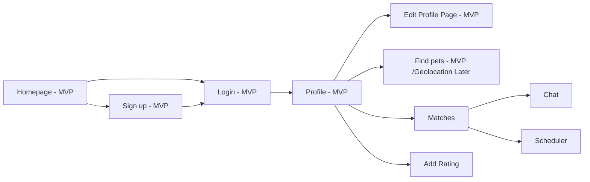
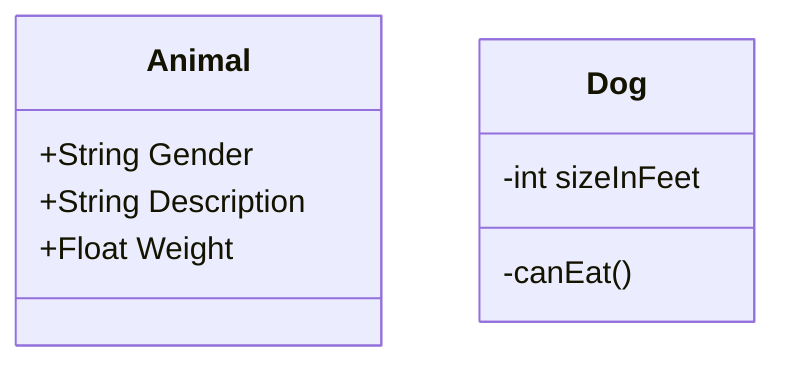

# Diagrams

## Web Flow

```mermaid
flowchart LR
    A[Homepage - MVP] --> B[Login - MVP]
    A --> C[Sign up - MVP]
    
    B -->D[Profile - MVP]
    C --> B

    D --> F[Edit Profile Page - MVP]
    D --> G[Find pets - MVP /Geolocation Later]
    D --> H[Matches]
    D --> I[Add Rating]

    H --> J[Chat]
    H --> K[Scheduler]
```

## Model Design

```mermaid
classDiagram
    class Animal{
        +String Gender
        +String Description
        +Float Weight

    }
    class Dog{
        -int sizeInFeet
        -canEat()
    }

```